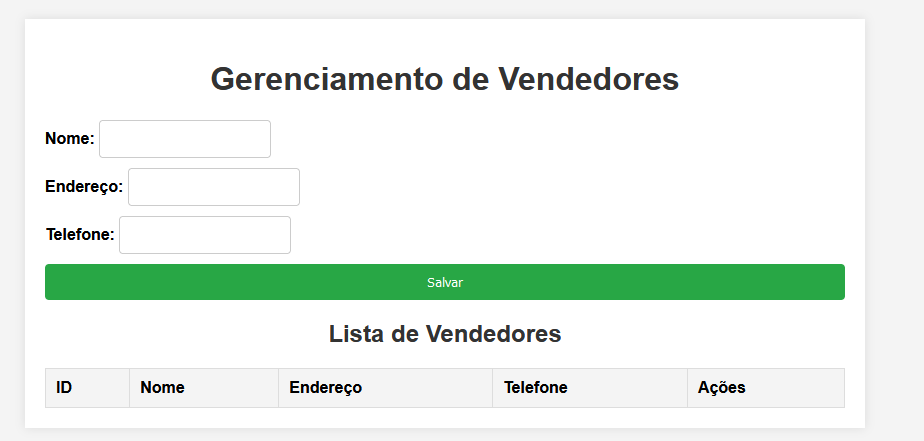
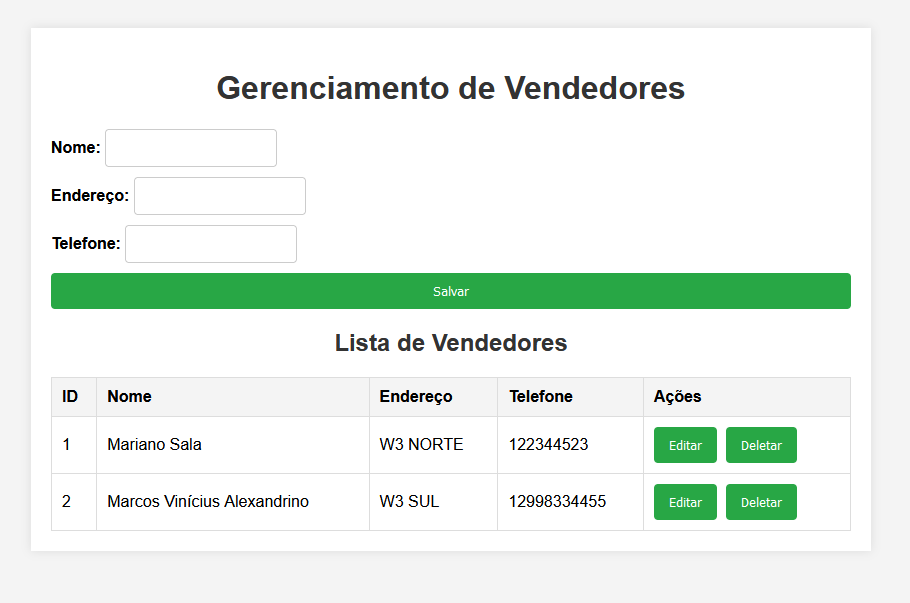

# bertoti3

<h1>Imagens dos métodos HTTP e também do BackComFront abaixo</h1>

O método Get sendo utilizado, acabei criando uma vendedora de nome Joana e fiz um método Get.

 
 

O método POST sendo utilizado, acabei criando um vendedor Miguel com o método POST no Postman.

 
 

O método PUT sendo utilizado para atualizar, modifiquei as informações da vendedora Joana, adicionando um salario para ela.
 Importante salientar que para concluir este método, utilizei a rota específica dela, passando o ID específico.

 
 

Por fim um método DELETE, onde eu deletei a vendedora Joana e ela acabou desaparecendo.
Importante salientar que para concluir este método, utilizei a rota específica dela, passando o ID específico.

 

Irei mostrar meu Front-End com Back-End

Primeiramente temos a tela inicial que permite a inclusão de nomes de vendedores, com nome, endereço e telefone

Testemos a inclusão de um novo nome: 

 

Podemos realizar a alteração deste específico nome, clicando na opção de "editar", a qual retorna a configuração do respectivo vendedor e permite alterarmos os valores dos campos.

 

Neste exemplo, mudamos o telefone

  
Vamos testar a opção de deletar, vamos inserir alguns novos nomes e depois os excluir

 

Tem muitos nomes, não é mesmo? Podemos excluí-los conforme a necessidade, clicando no botão "deletar"

